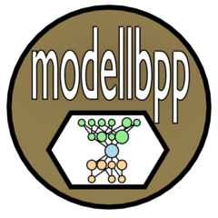

<!-- badges: start -->
[](https://lifecycle.r-lib.org/articles/stages.html#stable)
[](https://www.repostatus.org/#active)
[](https://CRAN.R-project.org/package=modelbpp)
[](https://cran.r-project.org/package=modelbpp)
[](https://github.com/sfcheung/modelbpp)
[](https://github.com/sfcheung/modelbpp/commits/main)
[](https://github.com/sfcheung/modelbpp/actions/workflows/R-CMD-check.yaml)
<!-- badges: end -->

# modelbpp: Model BIC Posterior Probability 

(Version 0.1.3.12 updated on 2024-06-18, [release history](https://sfcheung.github.io/modelbpp/news/index.html))

This package is for assessing model uncertainty in structural
equation modeling (SEM) by the BIC posterior
probabilities of the fitted model and its neighboring models,
based on the method presented in Wu, Cheung, and Leung (2020).
The package name, `modelbpp`,
stands for `model` `b`ayesian `p`osterior `p`robability.

- Wu, H., Cheung, S. F., & Leung, S. O. (2020).
  Simple use of BIC to assess model selection uncertainty:
  An illustration using mediation and moderation models.
  *Multivariate Behavioral Research*, *55*(1), 1--16.
  https://doi.org/10.1080/00273171.2019.1574546

# Homepage

For more information on this package, please visit its GitHub page:

[https://sfcheung.github.io/modelbpp/](https://sfcheung.github.io/modelbpp/)

# Installation

The stable CRAN version can be installed by `install.packages()`:

```r
install.packages("modelbpp")
```

The latest developmental-but-stable version of this package can be installed by `remotes::install_github`:

```r
remotes::install_github("sfcheung/modelbpp")
```

# Issues

If you have any suggestions or found any bugs, please feel
feel to open a GitHub issue. Thanks.

https://github.com/sfcheung/modelbpp/issues
