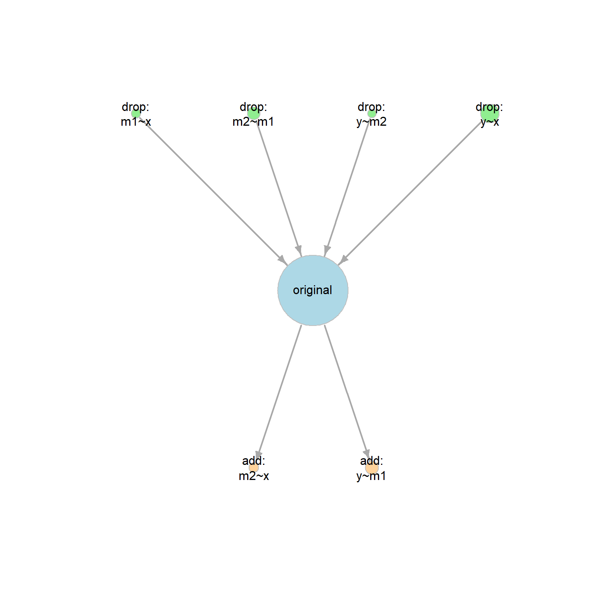
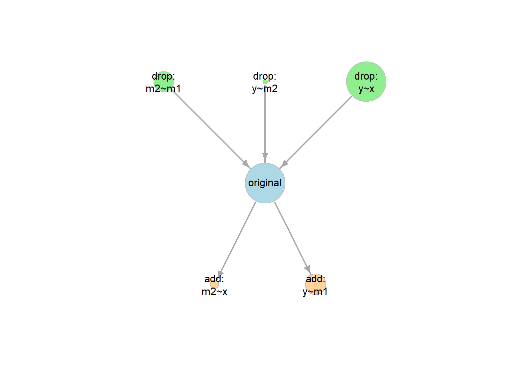

# Introduction

This article illustrates how to
use `model_set()` and other functions
from the package
[`modelbpp`](https://sfcheung.github.io/modelbpp/)
to:

- Fit a set of neighboring models,
  each has one more or one less degree
  of freedom than the original fitted
  model.

- Compute the BIC posterior probability
  (BPP), for each model [@wu_simple_2020].

- Use BPP to assess to what extent
  each model is supported by the
  data, compared to all other models
  under consideration.

# Workflow

1. Fit an SEM model, the
    original model, as usual in `lavaan`.

2. Call `model_set()` on the output from
  Step 1. It will automatically do the
  following:

    - Enumerate the neighboring models
      of the original model.

    - Fit all the models and compute their
      BIC posterior probabilities (BPPs).

3. Examine the results by:

    - printing the output of `model_set()`, or

    - generating a graph using `model_graph()`.

# Example

This is a sample dataset,
`dat_serial_4_weak`,
with four variables:


``` r
library(modelbpp)
head(dat_serial_4_weak)
#>             x         m1         m2          y
#> 1  0.09107195  1.2632493  0.7823926  0.3252093
#> 2 -1.96063838 -0.7745526  0.2002867 -0.6379673
#> 3  0.20184014  0.2238152  0.2374072  0.4205998
#> 4 -2.25521708  0.1185732 -0.1727878  0.9320889
#> 5 -0.15321350  0.1509888  1.1251386  0.6892537
#> 6 -2.00640303 -0.1595208 -0.1553136 -0.2364792
```

## Step 1: Fit the Original Model

Fit this original model, a serial
mediation model, with one direct path,
from `x` to `y`:


``` r
library(lavaan)
mod1 <-
"
m1 ~ x
m2 ~ m1
y ~ m2 + x
"
fit1 <- sem(mod1, dat_serial_4_weak)
```

This the summary:


``` r
summary(fit1,
        fit.measures = TRUE)
#> lavaan 0.6-19 ended normally after 1 iteration
#> 
#>   Estimator                                         ML
#>   Optimization method                           NLMINB
#>   Number of model parameters                         7
#> 
#>   Number of observations                           100
#> 
#> Model Test User Model:
#>                                                       
#>   Test statistic                                 3.376
#>   Degrees of freedom                                 2
#>   P-value (Chi-square)                           0.185
#> 
#> Model Test Baseline Model:
#> 
#>   Test statistic                                39.011
#>   Degrees of freedom                                 6
#>   P-value                                        0.000
#> 
#> User Model versus Baseline Model:
#> 
#>   Comparative Fit Index (CFI)                    0.958
#>   Tucker-Lewis Index (TLI)                       0.875
#> 
#> Loglikelihood and Information Criteria:
#> 
#>   Loglikelihood user model (H0)               -216.042
#>   Loglikelihood unrestricted model (H1)       -214.354
#>                                                       
#>   Akaike (AIC)                                 446.084
#>   Bayesian (BIC)                               464.320
#>   Sample-size adjusted Bayesian (SABIC)        442.212
#> 
#> Root Mean Square Error of Approximation:
#> 
#>   RMSEA                                          0.083
#>   90 Percent confidence interval - lower         0.000
#>   90 Percent confidence interval - upper         0.232
#>   P-value H_0: RMSEA <= 0.050                    0.261
#>   P-value H_0: RMSEA >= 0.080                    0.628
#> 
#> Standardized Root Mean Square Residual:
#> 
#>   SRMR                                           0.050
#> 
#> Parameter Estimates:
#> 
#>   Standard errors                             Standard
#>   Information                                 Expected
#>   Information saturated (h1) model          Structured
#> 
#> Regressions:
#>                    Estimate  Std.Err  z-value  P(>|z|)
#>   m1 ~                                                
#>     x                 0.187    0.059    3.189    0.001
#>   m2 ~                                                
#>     m1                0.231    0.091    2.537    0.011
#>   y ~                                                 
#>     m2                0.341    0.089    3.835    0.000
#>     x                 0.113    0.052    2.188    0.029
#> 
#> Variances:
#>                    Estimate  Std.Err  z-value  P(>|z|)
#>    .m1                0.278    0.039    7.071    0.000
#>    .m2                0.254    0.036    7.071    0.000
#>    .y                 0.213    0.030    7.071    0.000
```


The fit is acceptable, though the RMSEA
is marginal (CFI = 0.958,
RMSEA = 0.083).

## Step 2: Call `model_set()`

Use `model_set()` to find the
neighboring models differ
from the target model by one on model
degrees of freedom, fit them, and compute
the BPPs:


``` r
out1 <- model_set(fit1)
```

## Step 3: Examine the Results

To examine the results, just print
the output:


``` r
out1
#> 
#> Call:
#> model_set(sem_out = fit1)
#> 
#> Number of model(s) fitted           : 7
#> Number of model(s) converged        : 7
#> Number of model(s) passed post.check: 7
#> 
#> The models (sorted by BPP):
#>             model_df df_diff Prior     BIC   BPP   cfi rmsea  srmr
#> original           2       0 0.143 464.320 0.323 0.958 0.083 0.050
#> drop: y~x          3      -1 0.143 464.340 0.320 0.848 0.129 0.095
#> add: y~m1          1       1 0.143 465.900 0.147 1.000 0.000 0.018
#> drop: m2~m1        3      -1 0.143 465.953 0.143 0.800 0.148 0.116
#> add: m2~x          1       1 0.143 468.575 0.038 0.939 0.142 0.046
#> drop: m1~x         3      -1 0.143 469.403 0.025 0.695 0.183 0.124
#> drop: y~m2         3      -1 0.143 473.291 0.004 0.577 0.216 0.133
#> 
#> Note:
#> - BIC: Bayesian Information Criterion.
#> - BPP: BIC posterior probability.
#> - model_df: Model degrees of freedom.
#> - df_diff: Difference in df compared to the original/target model.
#> - To show cumulative BPPs, call print() with 'cumulative_bpp = TRUE'.
#> - At least one model has fixed.x = TRUE. The models are not checked for
#>   equivalence.
#> - Since Version 0.1.3.5, the default values of exclude_feedback and
#>   exclude_xy_cov changed to TRUE. Set them to FALSE to reproduce
#>   results from previous versions.
```


The total number of models examined,
including the original model, is 7.

(Note: The total number of models
was 9 in previous version. Please
refer to the Note in the printout for
the changes.)

The BIC posterior probabilities
(BPPs) suggest that
the original model is indeed the most
probable model based on BPP. However,
the model with the direct path
dropped, `drop: y~x`, only
has slightly lower BPP
(0.320)

This suggests that, with equal prior
probabilities [@wu_simple_2020], the
support for the model with the direct
and without the direct path have similar
support from the data based on BPP.

Alternatively, we can use `model_graph()`
to visualize the BPPs and model relations
graphically:


``` r
graph1 <- model_graph(out1)
plot(graph1)
```

<div class="figure" style="text-align: center">

<p class="caption">plot of chunk graph1</p>
</div>

Each node (circle) represents one model.
The larger the BPP, the larger the node.

The arrow points from a simpler
model (a model with larger model *df*)
to a more complicated model (a model
with smaller model *df*). If two models
are connected by an arrow, then
one model can be formed from another model
by adding or removing one free parameter
(e.g., adding or removing one path).

## Repeat Step 2 with User Prior

In real studies, not all models are
equally probable before having data
(i.e., not all models have equal
prior probabilities). A researcher
fits the original model because

- its
  prior probability is higher than other
  models, at least other neighboring
  models (otherwise, it is not worthy
  of collecting data assess thi original
  model), but

- the prior probability
  is not so high to eliminate the need
  for collecting data to see how much it is
  supported by data.

Suppose we decide that the prior probability
of the original model is .50: probable, but
still needs data to decide whether it is
empirically supported

This can be done by setting `prior_sem_out`
to the desired prior probability when calling
`model_set()`:


``` r
out1_prior <- model_set(fit1,
                        prior_sem_out = .50)
```

The prior probabilities of all other
models are equal. Therefore, with
nine models and the prior of the target
model being .50, the prior probability
of the other eight model is (1 - .50) / 8
or .0625.

This is the printout:


``` r
out1_prior
#> 
#> Call:
#> model_set(sem_out = fit1, prior_sem_out = 0.5)
#> 
#> Number of model(s) fitted           : 7
#> Number of model(s) converged        : 7
#> Number of model(s) passed post.check: 7
#> 
#> The models (sorted by BPP):
#>             model_df df_diff Prior     BIC   BPP   cfi rmsea  srmr
#> original           2       0 0.500 464.320 0.741 0.958 0.083 0.050
#> drop: y~x          3      -1 0.083 464.340 0.122 0.848 0.129 0.095
#> add: y~m1          1       1 0.083 465.900 0.056 1.000 0.000 0.018
#> drop: m2~m1        3      -1 0.083 465.953 0.055 0.800 0.148 0.116
#> add: m2~x          1       1 0.083 468.575 0.015 0.939 0.142 0.046
#> drop: m1~x         3      -1 0.083 469.403 0.010 0.695 0.183 0.124
#> drop: y~m2         3      -1 0.083 473.291 0.001 0.577 0.216 0.133
#> 
#> Note:
#> - BIC: Bayesian Information Criterion.
#> - BPP: BIC posterior probability.
#> - model_df: Model degrees of freedom.
#> - df_diff: Difference in df compared to the original/target model.
#> - To show cumulative BPPs, call print() with 'cumulative_bpp = TRUE'.
#> - At least one model has fixed.x = TRUE. The models are not checked for
#>   equivalence.
#> - Since Version 0.1.3.5, the default values of exclude_feedback and
#>   exclude_xy_cov changed to TRUE. Set them to FALSE to reproduce
#>   results from previous versions.
```

If the prior of the target is set to .50,
then, taking into account both the prior
probabilities and the data, the target
model is strongly supported by the data.

This is the output of `model_graph()`:


``` r
graph1_prior <- model_graph(out1_prior)
plot(graph1_prior)
```

<div class="figure" style="text-align: center">

<p class="caption">plot of chunk out1_prior</p>
</div>

# Advanced Options

## More Neighboring Models

If desired, we can enumerate models
"farther away" from the target model.
For example, we can set the
maximum difference
in model *df* to 2, to include models
having two more or two less *df* than
the original model:


``` r
out1_df2 <- model_set(fit1,
                      df_change_add = 2,
                      df_change_drop = 2)
```

This is the printout. By default, when there
are more than 20 models, only the top 20
models on BPP will be printed:


``` r
out1_df2
#> 
#> Call:
#> model_set(sem_out = fit1, df_change_add = 2, df_change_drop = 2)
#> 
#> Number of model(s) fitted           : 14
#> Number of model(s) converged        : 14
#> Number of model(s) passed post.check: 14
#> 
#> The models (sorted by BPP):
#>                  model_df df_diff Prior     BIC   BPP   cfi rmsea  srmr
#> original                2       0 0.071 464.320 0.269 0.958 0.083 0.050
#> drop: y~x               3      -1 0.071 464.340 0.267 0.848 0.129 0.095
#> add: y~m1               1       1 0.071 465.900 0.122 1.000 0.000 0.018
#> drop: m2~m1             3      -1 0.071 465.953 0.119 0.800 0.148 0.116
#> drop: m2~m1;y~x         4      -2 0.071 465.973 0.118 0.690 0.160 0.149
#> add: m2~x               1       1 0.071 468.575 0.032 0.939 0.142 0.046
#> drop: m1~x              3      -1 0.071 469.403 0.021 0.695 0.183 0.124
#> drop: m1~x;y~x          4      -2 0.071 469.423 0.021 0.585 0.185 0.144
#> add: m2~x;y~m1          0       2 0.071 470.154 0.015 1.000 0.000 0.000
#> drop: m1~x;m2~m1        4      -2 0.071 471.036 0.009 0.536 0.196 0.160
#> drop: y~m2              3      -1 0.071 473.291 0.003 0.577 0.216 0.133
#> drop: y~m2;y~x          4      -2 0.071 474.819 0.001 0.422 0.218 0.170
#> drop: m2~m1;y~m2        4      -2 0.071 474.924 0.001 0.419 0.219 0.163
#> drop: m1~x;y~m2         4      -2 0.071 478.374 0.000 0.314 0.238 0.183
#> 
#> Note:
#> - BIC: Bayesian Information Criterion.
#> - BPP: BIC posterior probability.
#> - model_df: Model degrees of freedom.
#> - df_diff: Difference in df compared to the original/target model.
#> - To show cumulative BPPs, call print() with 'cumulative_bpp = TRUE'.
#> - At least one model has fixed.x = TRUE. The models are not checked for
#>   equivalence.
#> - Since Version 0.1.3.5, the default values of exclude_feedback and
#>   exclude_xy_cov changed to TRUE. Set them to FALSE to reproduce
#>   results from previous versions.
```

The number of models examined, including
the original model, is 14.

This is the output of `model_graph()`:


``` r
graph1_df2 <- model_graph(out1_df2,
                          node_label_size = .75)
plot(graph1_df2)
```

<div class="figure" style="text-align: center">

<p class="caption">plot of chunk graph1_df2</p>
</div>

Note: Due to the number of nodes,
`node_label_size` is used to reduce
the size of the labels.

## Excluding Some Parameters From the Search

When calling `model_set()`, users can
specify parameters that must be excluded
from the list to be added (`must_not_add`),
or must not be dropped (`must_not_drop`).

For example, suppose it is well
established that `m1~x` exists and should
not be dropped, we can exclude it
when calling `model_set()`


``` r
out1_no_m1_x <- model_set(fit1,
                          must_not_drop = "m1~x")
```

This is the output:


``` r
out1_no_m1_x
#> 
#> Call:
#> model_set(sem_out = fit1, must_not_drop = "m1~x")
#> 
#> Number of model(s) fitted           : 6
#> Number of model(s) converged        : 6
#> Number of model(s) passed post.check: 6
#> 
#> The models (sorted by BPP):
#>             model_df df_diff Prior     BIC   BPP   cfi rmsea  srmr
#> original           2       0 0.167 464.320 0.331 0.958 0.083 0.050
#> drop: y~x          3      -1 0.167 464.340 0.328 0.848 0.129 0.095
#> add: y~m1          1       1 0.167 465.900 0.150 1.000 0.000 0.018
#> drop: m2~m1        3      -1 0.167 465.953 0.147 0.800 0.148 0.116
#> add: m2~x          1       1 0.167 468.575 0.040 0.939 0.142 0.046
#> drop: y~m2         3      -1 0.167 473.291 0.004 0.577 0.216 0.133
#> 
#> Note:
#> - BIC: Bayesian Information Criterion.
#> - BPP: BIC posterior probability.
#> - model_df: Model degrees of freedom.
#> - df_diff: Difference in df compared to the original/target model.
#> - To show cumulative BPPs, call print() with 'cumulative_bpp = TRUE'.
#> - At least one model has fixed.x = TRUE. The models are not checked for
#>   equivalence.
#> - Since Version 0.1.3.5, the default values of exclude_feedback and
#>   exclude_xy_cov changed to TRUE. Set them to FALSE to reproduce
#>   results from previous versions.
```

The number of models reduced to 14.

This is the plot:


``` r
out1_no_m1_x <- model_graph(out1_no_m1_x)
plot(out1_no_m1_x)
```

<div class="figure" style="text-align: center">

<p class="caption">plot of chunk out1_no_m1_x</p>
</div>

## Models With Constraints

If the original model has equality
constraints, they will be included in
the search for neighboring models,
by default. That is, removing one
equality constraint between two models
is considered as a model with an
increase of 1 *df*.

## Recompute BPPs Without Refitting the Models

Users can examine the impact of the prior
probability of the original model without
refitting the models, by using
the output of `model_set()` as the
input, using the `model_set_out` argument:


``` r
out1_new_prior <- model_set(model_set_out = out1,
                            prior_sem_out = .50)
```

The results are identical to calling
`model_set()` with the original `lavaan`
output as the input:


``` r
out1_new_prior
#> 
#> Call:
#> model_set(model_set_out = out1, prior_sem_out = 0.5)
#> 
#> Number of model(s) fitted           : 7
#> Number of model(s) converged        : 7
#> Number of model(s) passed post.check: 7
#> 
#> The models (sorted by BPP):
#>             model_df df_diff Prior     BIC   BPP   cfi rmsea  srmr
#> original           2       0 0.500 464.320 0.741 0.958 0.083 0.050
#> drop: y~x          3      -1 0.083 464.340 0.122 0.848 0.129 0.095
#> add: y~m1          1       1 0.083 465.900 0.056 1.000 0.000 0.018
#> drop: m2~m1        3      -1 0.083 465.953 0.055 0.800 0.148 0.116
#> add: m2~x          1       1 0.083 468.575 0.015 0.939 0.142 0.046
#> drop: m1~x         3      -1 0.083 469.403 0.010 0.695 0.183 0.124
#> drop: y~m2         3      -1 0.083 473.291 0.001 0.577 0.216 0.133
#> 
#> Note:
#> - BIC: Bayesian Information Criterion.
#> - BPP: BIC posterior probability.
#> - model_df: Model degrees of freedom.
#> - df_diff: Difference in df compared to the original/target model.
#> - To show cumulative BPPs, call print() with 'cumulative_bpp = TRUE'.
#> - At least one model has fixed.x = TRUE. The models are not checked for
#>   equivalence.
#> - Since Version 0.1.3.5, the default values of exclude_feedback and
#>   exclude_xy_cov changed to TRUE. Set them to FALSE to reproduce
#>   results from previous versions.
```

## Many Neighboring Models

When a model has a lot of free parameters,
the number of neighboring models can be
large and it will take a long time to
fit all of them. Users can enable
parallel processing by setting `parallel`
to `TRUE` when calling `model_set()`.

## More Options

Please refer to the help page of
`model_set()` for options available.

# Further Information

For further information on other
functions,
please refer to their help pages.

# References
